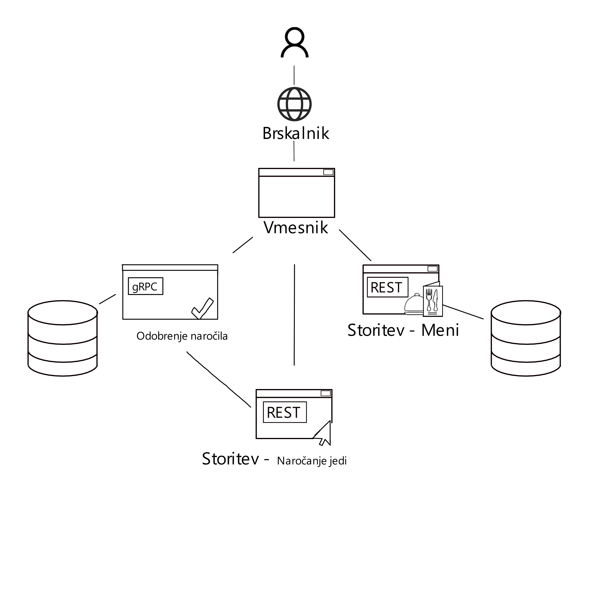

# System za upravljanje restavracije SmartPanda

SmartPanda je sistem kot poslovna rešitev pri poslovanju kitajske restavracije z imenom Panda. Ta sistem je v obliki spletne straini in vsebuje 3 storitve, ki so namenjene za stranke, zaposlene in lastnike odvisno od namen storitve

## 1.  Storitev za naročanje in spremljanje trenutne zaloge (Naročanje jedi):
   - Omogoča strankam naročanje izdelka 
   - Omogoča, da uporabnik spletne strani vidi trenutno zalogo hrane, ki so na voljo za naročit in kupit
   - Pri vsaki jedi lahku uporabnik spletne strani stisne na gumb podrobnosti, ki ga preusmeri na meni

## 2.Storitev za prikaz podatkov o jedeh (Meni):

  - Omogoča strankam vpogled v seznam vseh možnih jedi v restvraciji, kjer je pri vsaki jedi prikazan seznam podrobnosti kot so sestavine, kalorije, alergeni itd.

 
## 3. Storitev za naročila v dostavi (Odobrenje)

   - Izvede dejanske spremembe na podatkovni bazi, pri tem pa preverja ali lahko sploh izvede dejavnost (dovolj zaloge, brisanje podatkov čez čas itd. )

   

   Za zagon aplikacije se mora zagnati frontend in backend, kjer lahko uporabnik spletne strani dostopa preko spletne aplikacije, če hoče uporabnik izvesti operacijo kot je naročanje izdelkov vnaprej, se mora prijaviti na spletno stran, kjer se njegovi podatki hranijo v bazi.

  